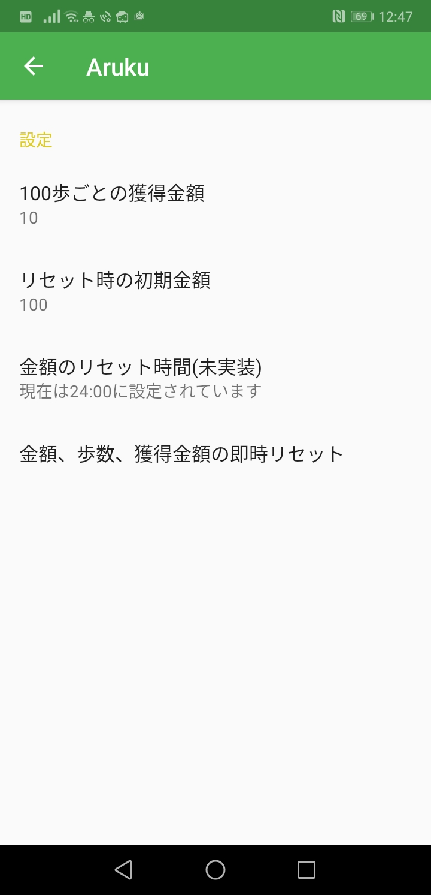

# Aruku
一日で使えるお金を歩数によって制限するアプリです。
買い食いによる、お金の使いすぎや、体重の増加を抑えることを目的としています。

　　

# インストール
android studioのプロジェクトです。cloneするか、
[こちら](./share)のapkファイルをダウンロードしてください。

# 使い方
1. ホーム画面に表示されている金額が、今日一日、外出で利用できるお金となります
2. お金を利用する場合、「使う」ボタンを押して利用する金額を入力してください
3. 獲得金額が多いと感じた場合や、初期金額が多いと感じた場合は、「設定」ボタンから調節できます。

# 環境
対応OS:Android 4.1以上

# 作者
- 作成者: 寺田　洋人
- e-mail: nezumi0803@gmail.com

# 注意事項
- TYPE_STEP_DETECTORを搭載していないスマートフォンでは、動作しません。  
- 現状ではバックグラウンドでの動作が安定していません。
